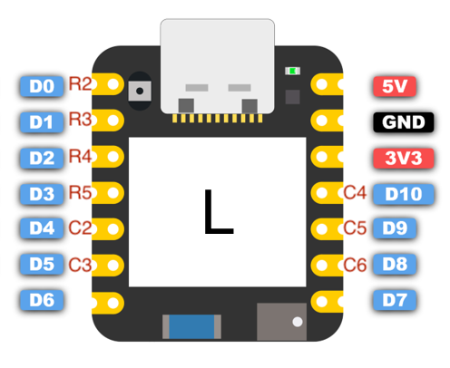

# zmk-config-skeletyl
wireless 3x5+3 using [Seeeduino XIAO BLE](https://wiki.seeedstudio.com/XIAO_BLE/)

### key matrix

|     | D4  | D5  | D10  | D9  | D8  | D8  | D9  | D10  | D5  | D4  |
| :-: | :-: | :-: | :-: | :-: | :-: | :-: | :-: | :-: | :-: | :-: |
| D0  |  q  |  w  |  f  |  p  |  b  |  j  |  l  |  u  |  y  |  '  |
| D1  |  a  |  r  |  s  |  t  |  g  |  m  |  n  |  e  |  i  |  o  |
| D2  |  z  |  x  |  c  |  d  |  v  |  k  |  h  |  ,  |  .  |  /  |
| D3  |  ⇥  |     | ⎋  |  ⏘  |     |     |  ⌫  |  ⌦  |     |  ⏎  |

- the red labels R2-R5 and C2-C6 correspond to the original BastardKB Skeletyl wiring matrix
- the XIAO MCU diagram is labeled "L" for left but the right-hand side is the same

## Miryoku Implementation

[Miryoku Reference Manual](https://github.com/manna-harbour/miryoku/tree/master/docs/reference)